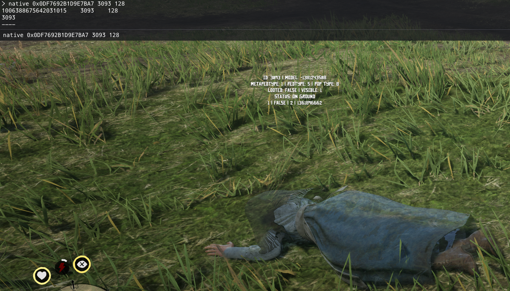
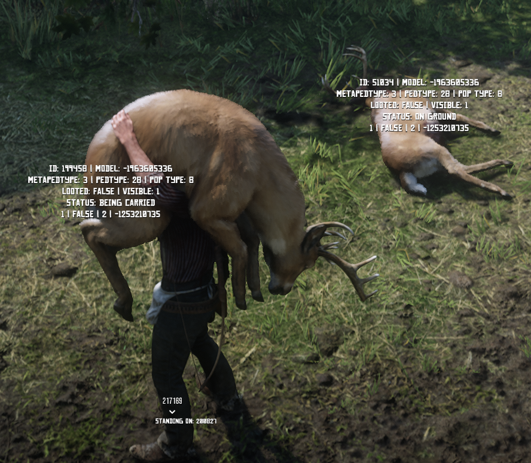
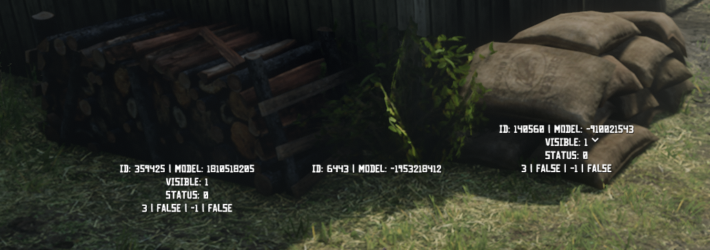

This is just a small collection of some random stuff I've been using to figure things out.

Displays Coordinates, Heading (including compass directions) and Time in the bottom left.

## Commands

`golden` will set your cores and outer bars to overpowered

`weather` can be used to quickly change the weather

`weapon` can be used to give yourself a weapon with ammo

`spawn` can be used to spawn a ped

`swap` can be used to quick swap models in a radius around player. Model is only swapped for a few seconds but is helpful for finding possible model names.

`model_search` can be used to find valid models quickly when they are numbered. It tests a few known numbering systems as a suffix to the input value.

`native` can be used to run native commands fairly easily from in game.

So if you wanted to give yourself a Pump Shotgun with the native command you can run:  
ex. `native 0xB282DC6EBD803C75 PLAYER_PED HASH_WEAPON_SHOTGUN_PUMP 500 true 0`  
This will automatically look up hashes if the string starts with `HASH_`. `PLAYER_PED` will be replaced using GetPlayerPed()

String starts with `HASH_` = GetHashKey of remaining string

String starts with `STR_` = CreateVarString of remaining string

`PLAYER_ID`/`P_ID` = PlayerId()

`PLAYER_PED`/`P_PED` = GetPlayerPed()

`PLAYER_COORD`/`P_COORD` = GetEntityCoords(PlayerPedId())

`PLAYER_COORD_GROUND`/`P_COORD_G` = GetEntityCoords(PlayerPedId()) - { 0.0, 0.0, 1.0 }

`PLAYER_DIR`/`P_DIR` = GetEntityHeading(PlayerPedId())

`true`/`false` Will be turned into a boolean

`0x3f`/`172`/`41.5` Will be turned into a number

Using `page_up` and `page_down` keys you can enable/disable tracking of `Peds/Vehicles` and `Entities/Objects`

