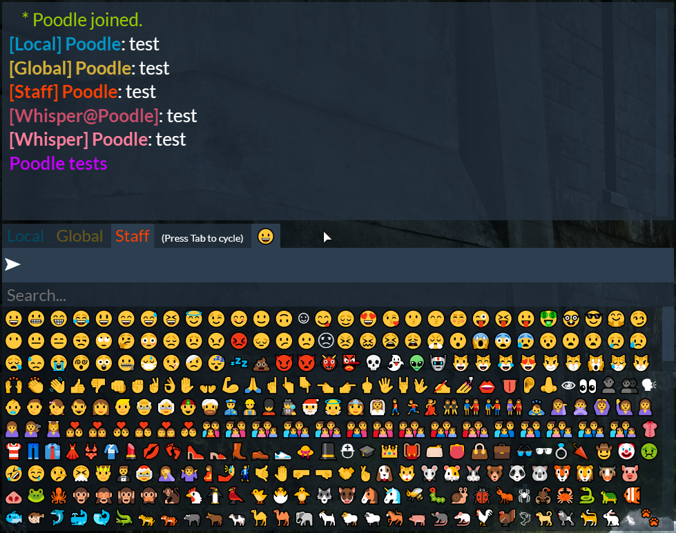

# PoodleChat



Chat resource used on the Poodle's Palace FiveM and RedM servers:
- [fivem.khzae.net](https://fivem.khzae.net)
- [redm.khzae.net](https://redm.khzae.net)

Based on the following resources:
- CitizenFX chat
- https://github.com/DevLanceGood/RPChat
- https://github.com/Tazi0/Server-Logging
- https://forum.cfx.re/t/release-emojis-for-chat-fivemojis-1-0/150713

# Features

- Text chat is proximity by default
- /global or /g to send a message to all players
- /whisper or /w to send a private message
- /staff channel based on an ace
- Optionally sends events and global messages to a Discord channel via a webhook
- Optionally displays messages from a Discord channel in-game
- Optionally send player reports to a Discord channel
- Configurable roles based on aces
- Configurable emoji shortcuts (`:heart:`, `:smile:`, and so on) and emoji selector

# Configuration

## General

The following variables in [shared/config.lua](shared/config.lua) control general settings for the chat:

| Variable                      | Description                                                           |
|-------------------------------|-----------------------------------------------------------------------|
| `Config.ActionColor`          | The colour for action messages (/me).                                 |
| `Config.DefaultLocalColor`    | The default colour for local messages.                                |
| `Config.DefaultGlobalColor`   | The default colour for global messages.                               |
| `Config.DefaultStaffColor`    | The default colour for staff messages.                                |
| `Config.WhisperColor`         | The colour for received whisper messages.                             |
| `Config.WhisperEchoColor`     | The colour for sent whisper messages.                                 |
| `Config.ActionDistance`       | The distance between players at which actions will be visible.        |
| `Config.LocalMessageDistance` | The distance between players at which local messages will be visible. |

## Discord

The following variables in [server/config.lua](server/config.lua) control the Discord integration:

| Variable                                           | Description                                                                          |
|----------------------------------------------------|--------------------------------------------------------------------------------------|
| `ServerConfig.DiscordWebhookId`                    | The webhook ID to use to send messages to a channel.                                 |
| `ServerConfig.DiscordWebhookToken`                 | The webhook token to use to send messages to a channel.                              |
| `ServerConfig.DiscordName`                         | The name to use when sending event messages (joins/disconnects).                     |
| `ServerConfig.DiscordAvatar`                       | The avatar to use when sending event messages or if no avatar is found for a player. |
| `ServerConfig.DiscordBotToken`                     | A Discord bot token to use in order to get messages and player avatars.              |
| `ServerConfig.DiscordChannel`                      | A Discord channel to echo messages in-game from.                                     |
| `ServerConfig.DiscordColor`                        | The colour for messages from Discord.                                                |
| `ServerConfig.DiscordReportWebhook`                | A Discord webhook to send player reports to.                                         |
| `ServerConfig.DiscordReportColor`                  | Colour used for the report message embed on Discord.                                 |
| `ServerConfig.DiscordReportFeedbackSuccessMessage` | Message sent to players upon successfully submitting a report.                       |
| `ServerConfig.DiscordReportFeedbackFailureMessage` | Message sent to players if a report fails to be submitted.                           |
| `ServerConfig.DiscordReportFeedbackColor`          | Colour for the above feedback message.                                               |
| `ServerConfig.DiscordRateLimit`                    | Time in milliseconds between any two Discord requests.                               |
| `ServerConfig.SteamKey`                            | A Steam key to use in order to retrieve avatars from Steam.                          |

All of these are optional, and can be left with their default value (empty string, `''`) to disable the Discord integration.

- For *sending* in-game messages to Discord, at minimum `ServerConfig.DiscordWebhookId` and `ServerConfig.DiscordWebhookToken` must be set.
- For *receiving* messages from Discord and displaying them in-game, at minimum `ServerConfig.DiscordBotToken` and `ServerConfig.DiscordChannel` must be set.

The ID and token of a Discord webhook can be found from the URL: `https://discord.com/api/webhooks/<id>/<token>`

## Staff channel

The `ServerConfig.StaffChannelAce` variable in [server/config.lua](server/config.lua) defines the ace that determines which players can access the Staff channel. By default, it is `chat.staffChannel`.

If you add/remove the ace for players while the server is running, you must run `poodlechat_refresh_perms` or restart the resource to apply the changes.

## Roles

Roles are labels that appear next to a player's name in chat, such as "Admin" or "Moderator". Each role is associated with an ace, so that any players with that ace will receive that role. Optionally, each role can be given a colour that overrides the default local and global chat colours for names.

The list of available roles is configured in [server/config.lua](server/config.lua).

Example:

```
Config.Roles = {
    {name = 'Admin', ace = 'chat.admin'},
    {name = 'Moderator', color = {0, 255, 0}, ace = 'chat.moderator'}
}
```

In `server.cfg`:

```
add_ace group.admin chat.admin allow
add_ace group.moderator chat.moderator allow
```

## Emoji

Shortcuts for emoji can be configured in [shared/emoji.lua](shared/emoji.lua).

# Commands

```
/clear
```

Clears the chat window history.

```
/global [message]
/g [message]
```

Sends a message to all players in the server.

```
/me [action]
```

Sends a message to nearby players in the form of `[name] [action]`.

```
/reply [message]
/r [message]
```

Sends a message to the last player that sent you a private message (`/whisper`) or that you sent a private message to.

```
/report [player] [reason]
```

If enabled, sends a player report to a specified Discord channel.

```
/say [message]
```

Sends a message to nearby players. The default text chat is also overridden to be proximity-based.

```
/staff [message]
```

Sends a message to all staff members.

```
/togglechat
```

Toggles the chat window on/off.

```
/whisper [player] [message]
/w [player] [message]
```

Sends a private message to a player. `[player]` can be either an ID number or name.
